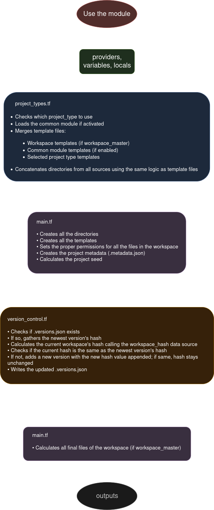

TODO: document the workspace_tree or whatever variable in the table

## Module Flow

<p align="center">
    
</p>

> [!NOTE]
> Don't take this as a guide for how Terraform works behind the scenes, I didn't create this to be faithful to how Terraform actually processes files or this project. Think of it more as a way to understand the general idea of the project and how the different .tf files interact with each other

## Module content

### Modules

| Name | Source | Description |
|------|--------|-------------|
| <a name="module_base"></a> [base](#module\_base) | ./project_types/base | It does not contain anything but has all the features of a project_type in case you want a clean template without having to create a `project_type` |
| <a name="module_workspace"></a> [workspace](#module\_workspace) | ./project_types/workspace | This is the module controlled by the `workspace_master`, this are the templates at workspace level |
| <a name="module_common"></a> [common](#module\_common) | ./project_types/common | These are templates that apply to all projects (it uses each project’s own metadata) |
| <a name="module_example_project"></a> [example\_project](#module\_example\_project) | ./project_types/example | This module is designed to be used as a reference for creating your own `projects` |
| <a name="module_terraform_project"></a> [terraform\_project](#module\_terraform\_project) | ./project_types/terraform | Contains very basic files for a Terraform project |
| <a name="module_ansible_project"></a> [ansible\_project](#module\_ansible\_project) | ./project_types/ansible | Contains the directory structure recommended by its documentation |

> [!NOTE]
> The modules under the workspace modules are refeered as `project_types` in the documentation

### Inputs

| Name | Description | Type | Default | Required |
|------|-------------|------|---------|:--------:|
| <a name="input_common"></a> [common](#input\_common) | Enables the common module | `bool` | `false` | no |
| <a name="input_create_templates"></a> [create\_templates](#input\_create\_templates) | Weather to create template files based on project type | `bool` | `true` | no |
| <a name="input_created_by"></a> [created\_by](#input\_created\_by) | User or program creating the workspace | `string` | `""` | no |
| <a name="input_description"></a> [description](#input\_description) | Description of the workspace purpose | `string` | `""` | no |
| <a name="input_environment"></a> [environment](#input\_environment) | Type of environment (dev, prod, etc.) | `string` | `"dev"` | no |
| <a name="input_extra_dirs"></a> [extra\_dirs](#input\_extra\_dirs) | Extra directories to create in the workspace | `list(string)` | `[]` | no |
| <a name="input_project_name"></a> [project\_name](#input\_project\_name) | Name of the project to create | `string` | n/a | yes |
| <a name="input_project_type"></a> [project\_type](#input\_project\_type) | The type of project you want to create | `string` | `"base"` | no |
| <a name="input_tags"></a> [tags](#input\_tags) | Tags to associate with the project | `map(string)` | `{}` | no |
| <a name="input_template_vars"></a> [template\_vars](#input\_template\_vars) | Variables for the templates | `map(string)` | `{}` | no |
| <a name="input_version_control"></a> [version\_control](#input\_version\_control) | This determines whether you want to use version control in your projects or not | `bool` | `false` | no |
| <a name="input_workspace_master"></a> [workspace\_master](#input\_workspace\_master) | This variable determines whether this project will be responsible for passing its variables to the templates at the workspace level | `bool` | `false` | no |
| <a name="input_workspace_path"></a> [workspace\_path](#input\_workspace\_path) | Base path where the workspace will be created | `string` | `"./workspaces"` | no |


> [!IMPORTANT]
> - Only one project should have `workspace_master = true` unexpected behavior may occur otherwise.
> - If no project has `workspace_master = true`, the `workspace` module will not be used.
> - Only projects with `common = true` will use the `common` module.
> - The `common` module uses metadata specific to each project.

### Outputs

| Name | Description |
|------|-------------|
| <a name="output_directories_created"></a> [directories\_created](#output\_directories\_created) | List of created directories in the workspace |
| <a name="output_metadata"></a> [metadata](#output\_metadata) | Project metadata |
| <a name="output_metadata_file_path"></a> [metadata\_file\_path](#output\_metadata\_file\_path) | Path to the workspace metadata |
| <a name="output_project_name"></a> [project\_name](#output\_project\_name) | Project name used |
| <a name="output_template_files_created"></a> [template\_files\_created](#output\_template\_files\_created) | Template files created |
| <a name="output_workspace_path"></a> [workspace\_path](#output\_workspace\_path) | Shows all the files in the workspace |
| <a name="output_workspace_path"></a> [workspace\_path](#output\_workspace\_path) | Full path of the created workspace |

> `workspace_files` depends `workspace_master = true`, if it does not exist then it will print an empty value.

## How to create your own project type

1. Go into the `project_types` folder under the module and copy the `example` project type

```bash
cp -r example ./my_project_type
```

2. Rename the `example.tf` file inside your new folder to match your project type:

```bash
mv example.tf my_project_type.tf
```

3. Modify it to your needs:

- `project_dirs`: these are the directories your project will have at creation time

- `templates`: if `create_templates = true`, these are the templates that will be used in the project

  - There are 3 examples of how to pass variables, read the comments in the file for details

4. Add your project_type

- Open `project_types.tf`

- Copy and paste the `example_project` module

- Edit the `source` of the module to point to your new project type

- Add your newly created module to the `available_modules {}` block

5. And that's it, you shoud have your own `project_type`

> [!NOTE]
> Remember to add any templates you create to the module’s .tf file. Otherwise, they will not be used.

## Known issues with more than one `workspace_master = true`

- Causes version control to create a new version on the second run, from that point on it remains consistent
